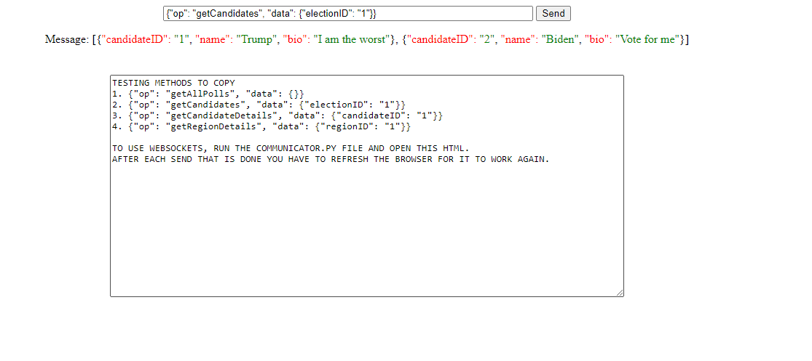

# Poll API Server
(This is the group project readme found within the src folder)
This documentation serves as a manual to the usage of the project at it's current stage. Please read through carefully before using the software.

# Websocket integrations
## Return value 
**All methods return in format: `{"msg": Stated return value, "success": int}`**

## Success types
The **Returns** column states what gets returned in the `msg` attribute.

| Success | Reason | Returns |
| ------ | ------ | ------ |
| 0 | Successful operation | The return value stated in the operation table |
| 400 | Invalid or missing parameters | An error message as a string with details on the issue |
| 401 | Authentication failed or a user related error occurred | An error message as a string with details on the issue |
| 404 | Requested object doesn't exist. When something get's fetched on an ID and doesn't exist. | An error message as a string with details on the issue |

## Operations
| # | Operation | Input Parameters | Return | Description |
| ------ | ------ | ------ | ------ | ------ |
| 1 | getAllPolls | `None` | [Poll] | Returns all polls on all available elections. |
| 2 | getElectables | `electionID: str` | [Electable] | Returns all candidates on a given election as string. |
| 3 | getElectableDetails | `electableID: str` | Electable | Returns details on a specific candidate. |
| 4 | getRegionDetails | `regionID: str` | Region | Returns details on a specific region. |
| 5 | getAllRegions | `None` | [Region] | Returns all available regions |
| 6 | getElection | `electionID: str` | Election | Returns details on a specific election. |
| 7 | getElections |` None` | [Election] | Returns all available elections |
| 8 | getSource | `sourceID: str` | Organization | Returns the requested organization if it exists. |
| 9 | getAllSources | `None` | [Organization] | Returns all sources. |
| 10 | getPollsBySourceName |  `sourceName: str` | [Poll] | Gets all polls from specific source. |
| 11 | getPollsByTimeframe | `startDate: str`, `endDate: str` | [Poll] | Gets all polls from specific timeframe. |
| 12 | getHistoricalPollsForElection | `electionID: int`, `startDate: str`, `endDate: str`| [Poll] | Gets all polls from specific election in a specific timeframe|
| 13 | getOverallElectionPoll | `electionID: str` | {candidate name; int} | Returns the overall election status in a readable form. Presented with the name of candidate and the number of votes he has. |
| 14 | getElectionStatistics | `electionID: str` | {candidate name; int} | Returns how many votes, in percentage, each candidate holds for all polls in a given election. |
| 15 | getAveragePoll | `electionID: str` | Poll | Returns the average amount of votes for each candidate for all polls in the given election. Method gets all the votes from each region in election and divides by the amount of polls in election. |
| 16 | login | `auth: {username: str, password: str}` | message: str | Logs in with user credentials. Must use special request attribute `auth` instead of `data`. **Enables** `login required` methods in system until logout or disconnection. |
| 17 | logout | `None` | message: str | Logs out an active user if logged in. |
| 18 | vote | `Login required`, `pollID: str`, `electableID: str` | message: str | Votes on desired poll. User must be registered in one of the regions valid for the poll. User can only vote once and the vote is irreversible. |
| 19 | createUser | `username: str`, `password: str`, `firstName: str`, `lastName: str`, `ssn: str`, `regionID: str`  | message: str | Creates a new user. |
| 20 | createPoll | `Login required`, `electionID: str`, `startDate: str`,` endDate: str` | Poll | Creates new poll and registers its creator.|
| 21 | createElection | `Login required`, `name: str` | Election | Creates a new election and registers its creator. |
| 22 | createElectable | `Login required`, `name: str`, `bio: str`. _Optional parameter_ `imageUrl: str` | Electable | Creates new electable and registers its creator. |
| 23 | createParty | `Login required` `name :str` `description :str` | Electable | Creates a new electable. This is the same method as createElectable |
| 24 | createCandidate | `Login required` `name :str` `description :str` | Electable | Creates a new electable. This is the same method as createElectable |
| 25 | createRegion | `Login required` `name: str` _optional_`population: str` _optional_`registeredVoters: str` | Region | Creates a new region and registers its creator. |
| 26 | deletePoll | `Login required`, `pollID: str` | message: str | Removes a specific poll that the user created. |
| 27 | deleteElection | `Login required`, `electionID: str` | message: str | Removes a specific election that the user created. |
| 28 | deleteElectable | `Login required`, `electableID: str` | message: str | Removes a specific electable that the user created. |
| 29 | deleteRegion | `Login required` `regionID: str` | message: str | Removes a specific region that the user created. |
| 30 | addElectionRegion | `Login required`, `electionID: str`, `regionID: str` | message: str | Adds a region to an election that the user created.|
| 31 | addElectionElectable | `Login required`, `electionID: str`, `electableID: str` | message: str | Adds an electable to an election that the user created.|
| 32 | getUserPolls | `Login required` | [Poll] | Returns all polls which the user created. |
| 33 | getUserElections | `Login required` | [Election] | Returns all elections which the user created. |
| 34 | getUserElectables | `Login required` | [Candidate] | Returns all electables (Candidate/Party) which the user created. |
| 35 | getUserRegions | `Login required` | [Region] | Returns all regions which the user created. |
| 36 | getElectionByName | `electionName: str` | Election | Returns an election with given name. |

# Project setup
To set up the project you must fufill the following

### Installation prerequisites 
1. **Install python**\
From the python website, install the latest verison of python and make sure you select the option to set python to path.\
If there's an option for including pip in your install, please select it.
Link: https://www.python.org/downloads/

2. **Install Pip**\
If not already installed when installing python, install pip.

3. **Install git**\
From git's website install their latest release. This is for version controll and repository cloning.
Link: https://git-scm.com/downloads

4. **Install Pycharm**\
This is not a requirement, however it's recommended not only because of python language support but also\
to make sure the environment setup and settings are done in the same way for everyone.

### Cloning the project
1. Open a desired destination folder for the project in terminal or using git bash
2. Make sure you have valid authentication for cloning the project.
3. Type the following in the console: `git clone https://gitlab.com/arieljarnason/hugb2020template.git`

### Setting up your environment
1. Navigate to the working directory (the [src](src) folder).
2. Open the src folder **as new pycharm project**
3. Navigate to project settings in pycharm
4. Create a virtual environment\
File -> Settings -> Interpreter -> Add Interpreter -> New environment -> Select your python version -> Apply -> Done
5. Install requirements\
This is usually prompted by pycharm after creating a new virtual environment.\
If it isn't then manually install according to the [pip_installs.txt](src/pip_installs.txt) file

# Testing
This section covers the different methods of testing we use in this project.\
We are using python's built in **unittest** module as our testing client.\
We strive to keep the coverage for the included packages above 80 precent.

### Testing your work
Make sure that you create test cases for all your created methods. This should be for both success and for failure.

### When to run tests
Before creating a merge request, make sure you have the latest version of master merged to your branch,\
_and then_ make sure that all test cases pass without errors.\
**Always merge with master before doing a system test for a merge.**

### How to test

1. **Testing package**\
To test the package you are working on you can include the following in the test file where your test class is located:
```
if __name__ == '__main__':
        unittest.main()
```
Then simply run the file from main.

2. **System test**\
From working directory run the following command in terminal:\
`$ python -m unittest`


# Coverage report
To see our overall coverage we generate a coverage report from the unittests we created.\
This is to show us what methods we are testing, and what statements are reached within our code.

### When to generate coverage report
In general the coverage report should be updated with every merge request to make sure we are meeting our coverage goals.\
However our gitlab CI automatically generates this during pipeline checks, and it can be looked at there. Therefore it is\
sufficient that the last person to submit before the deadline generate this report.

### Checking coverage
To check the coverage without generating a coverage report you can type the following command in terminal:\
`$ coverage run --omit="*/interface_layer/*" --source app -m unittest discover -s test -p test_*.py`\
`$ coverage report`

### Excluding from coverage report
To exclude a package from the coverage report you can do as in the following example:\
_Excluding interface_layer from coverage report_\
`--omit="*/interface_layer/*"`

_Result_\
`$ coverage run --omit="*/interface_layer/*" --source app -m unittest discover -s test -p test_*.py`

### How to generate a coverage report
From working directory run the following commans in terminal:
1. `$ coverage erase`
2. `$ coverage run --omit="*/interface_layer/*" --source app -m unittest discover -s test -p test_*.py`
3. `$ coverage html -d test\report\`


# Running the project
To run the project, start the local server by running the [communicator.py](src/app/interface_layer/communicator.py) file.
Then open the desired front end html in a browser:
- Our own testing client [websocketClient.html](src/app/presentation_layer/own_test_client/websocketClient.html)


- H1 interface, by cloning it from the gitlab repository https://gitlab.com/grischal/hugb20frontend/-/blob/h1/interface_h1.md
