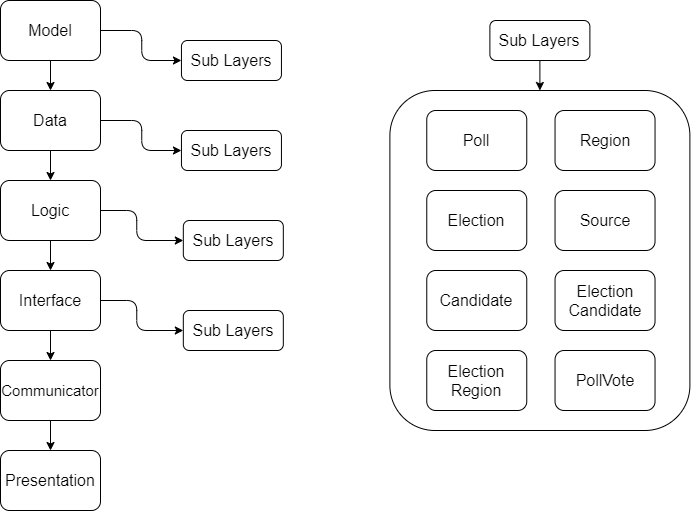

# System organization
## Repository
We set up **continuous integration (CI)** pipeline automation in the repository using GitLab ylm. 
This allowed us to automatically make sure all our tests passed before any integrations
were made in the project. No failed pipelines can be merged in the repository.

Furthermore we restricted all developers from merging their own code. That meant that for every
merge made there had to be a person reviewing the code alongside the CI verification.

## Software Structure
We have **layered our system extensively** to make sure that components are individually 
replaceable and updatable. This has benefited us greatly in the continuous (agile) development 
process. 

The software needs to be continuously updated according to ever new standards and having 
our software separated into **smaller components that are loosely coupled** makes the complexity 
of the changes less drastic.

Furthermore this has made our system more **manageable** for a group our size and allowed for 
**easier distribution of workload**.

## Work distribution
Having our project well layered allowed us to distribute work between team members in whichever
section of the project they deemed fit, without having much of an impact on others.

# Design patterns in system
_Within most of our software we make use of the SOLID principals._

1. **Layered Architecture**\
As mentioned in the software structure section, the system is divided into layers. The image below
depicts the current layering


2. **Singleton pattern** \
In the interface we have a class called **Communicator** which handles all websocket communication. 
This class prevents more than one instance of it to exist at runtime.

3. **Factory pattern** \
The factory pattern is a direct result of the layering done within our system. This makes our code more compact and 
reusable. The factory pattern in our data layer is depicted in the code demo below, however this is valid for the logic 
and interface layer aswell. The displayed methods and attributes from the class "Data" are inherited by child classes 
such as class Poll(Data).\
    **The parent class:**
    ```
    class Data:
        # Some methods removed for simplification
        def __init__(self):
            self.idf = 0  # The current largest ID in the list
       
        def add(self, model_object):
            """Add a model object to the database"""
            # removed for simplification
    
        def get(self, _id: int):
            """Get model data by id"""
            # removed for simplification
    
        def get_all(self):
            """Get all model data"""
            # removed for simplification
    
        def delete(self, _id: int):
            """Remove model data by id"""
            # removed for simplification
    
        def update(self, model_object):
            """Update a model"""
            # removed for simplification
    ```
    **The child class:**
    ```
    class PollData(Data):
        def __init__(self):
            super().__init__()
            self.data_path = self.get_filepath("../json_data/poll_data.json")
            self.idf = self.get_idf()
        # Inherits methods for add/update/delete/get/get_all ...
    ```
4. **Facade pattern** \
As an example of a facade pattern we can take our authentication package. It is a component integrated into the 
system using a simplified interface, which masks over the complicated tasks below. This is also intentional
to prevent tampering of authentication where it should not be possible from the outside. We provide simple usability
and prevent usage without those methods. (For reference you can read the README.txt in the auth package)

5. **Observer pattern** \
Our communicator class implements the observer pattern. It keeps a list of all it's dependents 
(mainly the interface classes) and calls their methods in an appropriate manner according to the websocket request.
This drastically simplifies the method mapping and overall usage of our websocket implementation.

6. **Data mapper pattern** \
To simplify and organize the usage of data we are taking advantage of model classes or data mappers. These classes map 
the data to and from the database. When we write new data to the database we use a method within the models for 
transforming a model to it's database representation, and when we fetch data from the database we transform them to 
models with a method within the model.

# Refactor possibilities
1. **The data storage** \
The data storage choice is definitely not ideal for scalability and the amount 
of data generated by the software. Ideally we would move to any type of SQL storage. This
would require only a few changes to the fetch/update methods in the data layer parent class. 

2. **The interface data adapter** \
Ideally we would have a separate component that adapts data to the front ends requirements. 
Currently we have methods for this in each logic layer. However as of right now the required 
data in the front end is pretty over complicated with cross references between our models making 
it quite a leap to create a data adapter.

3. **Testing approach** \
We would like to have our test automated and possibly more standardized. By having at least a part of the tests automated the errors would be fixed by the automation tool and on the same to look for similar errors. By standardized the test via IEEE-829 standards or similar standards the test would have better structure, higher coverage and would result in a better product.
