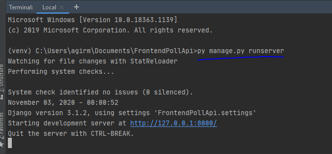
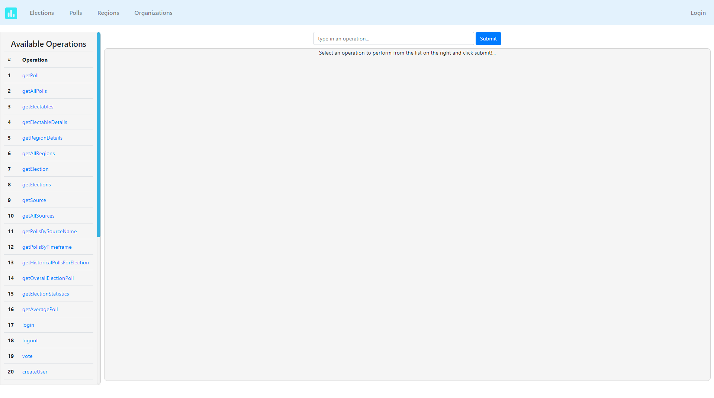
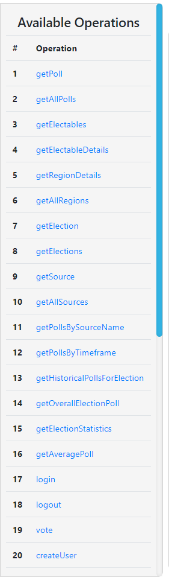
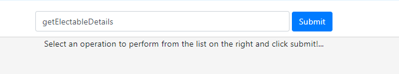
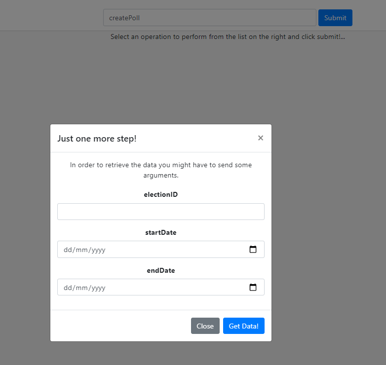
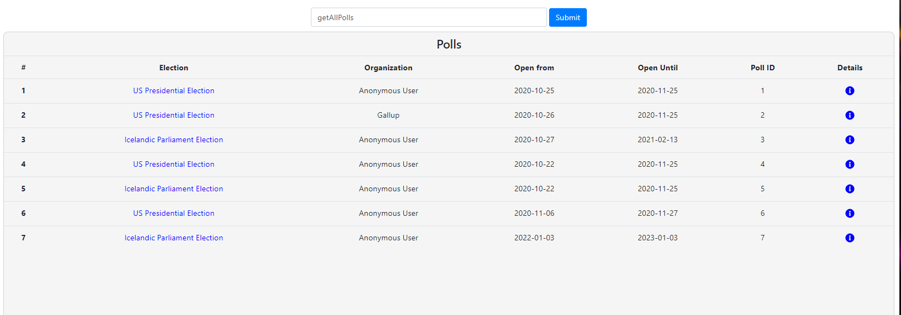
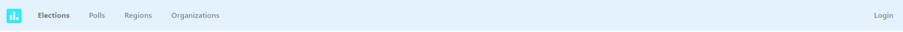
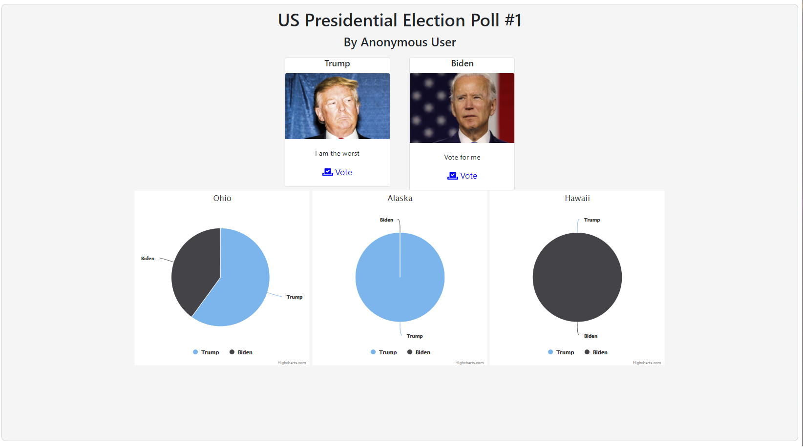
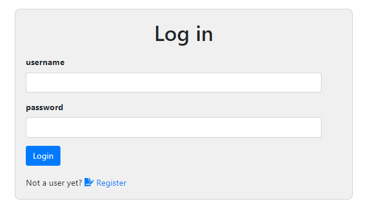
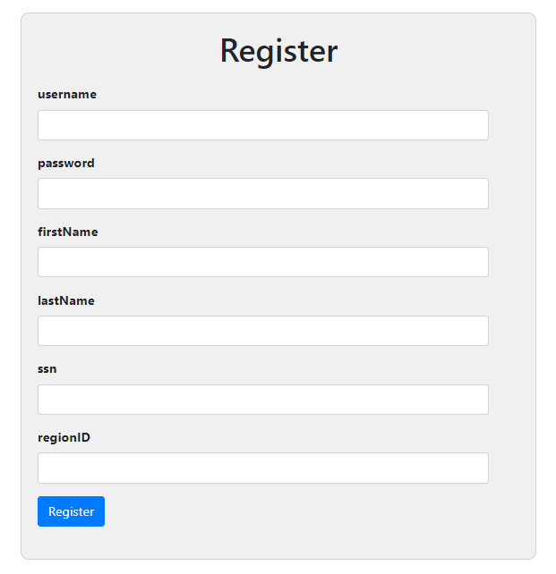

_Author: Ægir Máni Hauksson, aegir19@ru.is_

This part is an addon I created to display the backend implementation. The backend itself (src) is a server hosted by the python module "websockets". In this implementation in django we communicate with the backend using an async websocket receiver. (PollApiGateway)
# FRONTEND: SETUP AND USAGE

#### 1. Installing
1. Open the folder poll_api_frontend as a project using pycharm.
2. Create a virtual environment inside your project folder (poll_api_frontend) by following these steps:
    1. Press Ctrl-Alt-S (Should open settings)
    2. Press the "Project" dropdown
    3. Press the "Python interpreter" menu
    4. In the top right hand side press the wheel and press add iterpreter
    5. Select initialize new environment, select python as interpreter and press apply.
        Press ok when done.
    6. When you look at the terminal in PyCharm it should now say (venv) in front of C:...
       If not, navigate into the folder venv/Scripts from terminal, type activate and press enter

3. Install requirements \
a) Should be prompted by IDE, if not install manually with `$ pip install -r requirements.txt` \
b) by manually pip installing the requirements from the pip_installs.txt file. \
c) Go into the requirements.txt file and then if will promt you to install the requirements (works if your venv is activated)

#### 2. Migrating database
_There is not really any database dependecies apart from the django messages but the django framework will not work correctly without the migration._
1. While in the front_end_pollApi directory type in terminal \
    `py manage.py migrate`

2. This should load all the database settings and Dependencies to your own sqlite file

#### 3. Run the server
1. Type in terminal: `$ python manage.py runserver` \

#### 4. Open the browser
1. When running the server with the runserver command you can then click the url shown in terminal to open the browser.
2. **Make sure the backend server is online as well! Otherwise nothing will work**

# FRONTEND: DEMO
#### Landing page

#### Operation menu
All the available operations are presented in the menu in the right hand side of the screen. By pressing them 
they will appear in the operation input field in the top middle of the screen. \

#### Operation input

#### Operation input submit
Once you've selected an operation then you can press the submit button to be prompted the required
arguments to retrieve the data. In the following image for example I've requested the operation 
createPoll, and get prompted the following: \

#### Get data
Once you've filled out all the fields you can press "get data" to retrieve a response from the server.

#### Navbar quickselect
The navigation bar contains a variety of shortcuts to the operations. \

#### Poll detail page
The poll detail page gives you an overview with statistics and candidates, as well as the option to 
vote on the candidates. \

#### Login
There's an additioal login page, for ease of use. \

#### Register
There's an additional registration page, for ease of use, that saves your inputs in case you made a mistake. \

